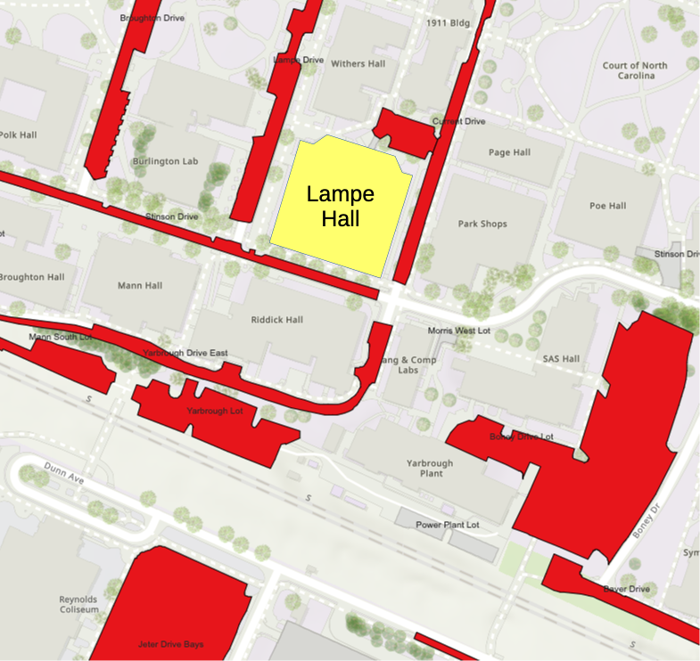

# NC State ICPC Mid-Atlantic Regional Contest Site

## Location

All events for the NCSU site will be in Lampe Hall, the building
formerly named Daniels Hall.  Lampe Hall is on main campus, not
Centennial Campus, where most of the engineering building are.

## Schedule

The following schedule shows events for contest day, on November 8.
It's pretty much the same as the schedules at other sites.

| Time             | Activity                          |                Location |
| ---------------- | --------------------------------- | ----------------------- |
|  9:15 - 10:00 am | Registration and Light Breakfast  |   Lampe 2nd floor lobby |
| 10:00 - 11:00 am | Welcoming remarks                 |          Lampe room 218 |
| 11:00 am - noon  | Practice problems                 | Lampe rooms 200 and 255 |
| noon - 1:15 pm   | Lunch                             |   Lampe 2nd floor lobby |
| 1:30 - 6:30 pm   | Competition                       | Lampe rooms 200 and 255 |
| 6:30 - 7:15 pm   | Dinner                            |   Lampe 2nd floor lobby |
| 7:00 - 7:15 pm   | Awards presentation               |          Lampe room 218 |

## Equipment

For the contest, we will be using desktop computers in two labs.
Teams should not need to bring any of their own equipment for the
contest.  These labs normally seat 30 to 40 students.  We'll be
putting each teem on a row of desks that normally seats three or four
students, so each team should have plenty of space.  There will be
other desktop machines, but only one machine will be used for
the contest.  The keybords and mice for the other machines on the row
can be moved to the edge of the desk, to provide more space for
working.

These computers will be running the standard contest image for our
site.  The main [mid-atlantic web
page](https://ma.na.icpc.global) has some information
about languages and development tools available on this image.

## Network Access

NCSU has a guest network named ncsu-guest. The eduroam network is also available.

## Parking

You should be able to park in most faculty spaces on the weekend, and
I expect there will be a lot of spaces available near Lampe Hall when
teams start arriving for the contest.  There are a few spaces where
parking rules are enforced over the weekend.  It seems like there are
more of these this year, so you will want to check for a sign with the
parking rules as you pull into a space or into a lot lot.

The figure below shows some of the facutly spaces (in red) near Lampe
Hall.  The Yarbrough Lot south of Lampe is being used for
construction.  If you have trouble finding a space, the large Jeter
Drive lot to the south or the Boney Drive lot to the south-east should
have plenty of spaces.  From either of these, it will be less than a
five minute walk to Lampe.

